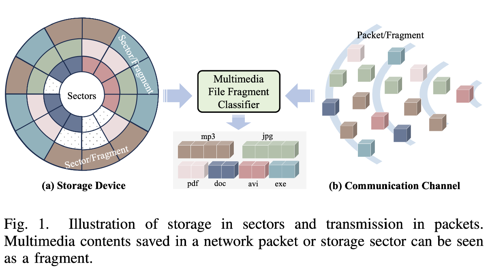
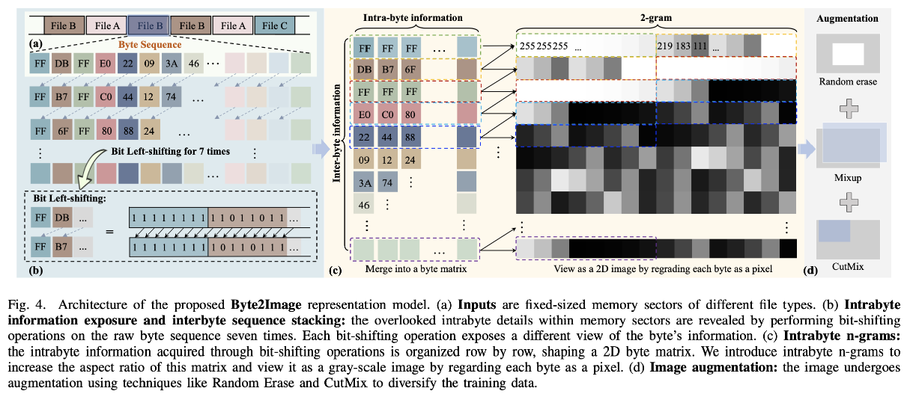
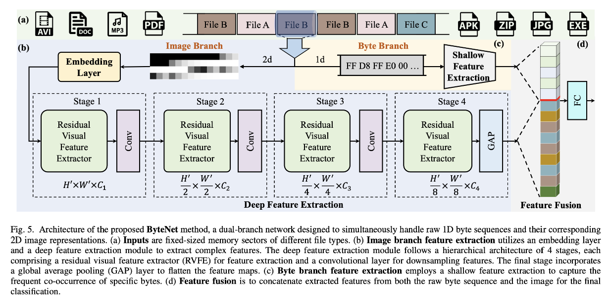
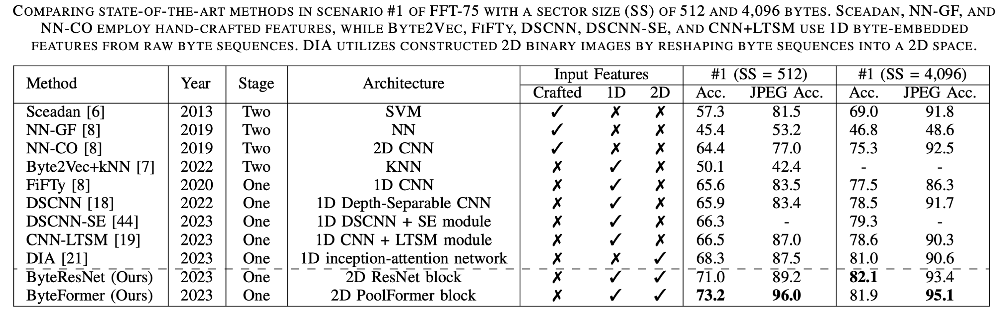

# Byte2Image

**A Byte Sequence is Worth an Image: CNN for File Fragment Classification Using Bit Shift and n-Gram Embeddings**  
*Wenyang Liu, Yi Wang, Kejun Wu, Kim-Hui Yap and Lap-Pui Chau*  
Accepted in AICAS2023

**ByteNet: Rethinking Multimedia File Fragment Classification through Visual Perspectives**  
*Wenyang Liu, Kejun Wu, Tianyi Liu, Yi Wang, Kim-Hui Yap and Lap-Pui Chau*  
The extended version is accepted in IEEE Transactions on Multimedia (TMM) 2024

---

## Introduction

This repository contains the official implementation of **Byte2Image**, a framework for multimedia file fragment classification that leverages visual-based methods. It supports:
- **ByteNet**, which employs CNN-based architectures for classification.
- **Advanced bit-shift and n-gram embeddings**, providing robust feature representation for byte sequences.
 
### Motivation
<div align="center">
  
</div>
Multimedia content carried in a network packet or storage sector can be seen as a “fragment”. Multimedia systems generally deliver/store a collection of multiple media sources, e.g., text, audio, image, and video in a fragment-by-fragment manner. Therefore, the variety of media types requires multimedia file fragment classification (MFFC), especially in unreliable communication channels and corrupted storage devices for cyber security and digital forensics. An accurate MFFC enables a more resilient multimedia system against channel errors and storage corruption.

### Byte2Image Transformation
  

### Overall Structure
  

### Result on FFT-75 Dataset
  


---

## Getting Started

### Installation

Clone the repository:

```bash
git clone https://github.com/your-repository/Byte2Image.git
cd Byte2Image
```

## Training

To train the model on the dataset, run:

```
python train_resnet_512.py --phase train --name ResNet_512/3 --gpu_ids 0,1 --data 512 --scen 3
```

## Testing

To evaluate the model on the test dataset, run:
```
python train_resnet_512.py --phase test --name ResNet_512/3 --gpu_ids 0,1 --data 512 --scen 3
```

---

## Pretrained Checkpoints

Download the pretrained checkpoints from the link below:

[Pretrained Checkpoints](https://drive.google.com/file/d/1e_Ou7UDajOGCLaCy-KYgmSOYcjFQnj3g/view?usp=sharing)

---

## Citing Our Work
```
@inproceedings{liu2023byte,
  title={A Byte Sequence is Worth an Image: CNN for File Fragment Classification Using Bit Shift and n-Gram Embeddings},
  author={Liu, Wenyang and Wang, Yi and Wu, Kejun and Yap, Kim-Hui and Chau, Lap-Pui},
  booktitle={2023 IEEE 5th International Conference on Artificial Intelligence Circuits and Systems (AICAS)},
  pages={1--5},
  year={2023},
  organization={IEEE}
}

@ARTICLE{Liu_TMM,
    author={Liu, Wenyang and Wu, Kejun and Liu, Tianyi and Wang, Yi and Yap, Kim-Hui and Chau, Lap-Pui},
    journal={IEEE Transactions on Multimedia}, 
    title={ByteNet: Rethinking Multimedia File Fragment Classification through Visual Perspectives}, 
    year={2024},
    volume={},
    number={},
    pages={1-14},
    doi={10.1109/TMM.2024.3521830}
}
```
